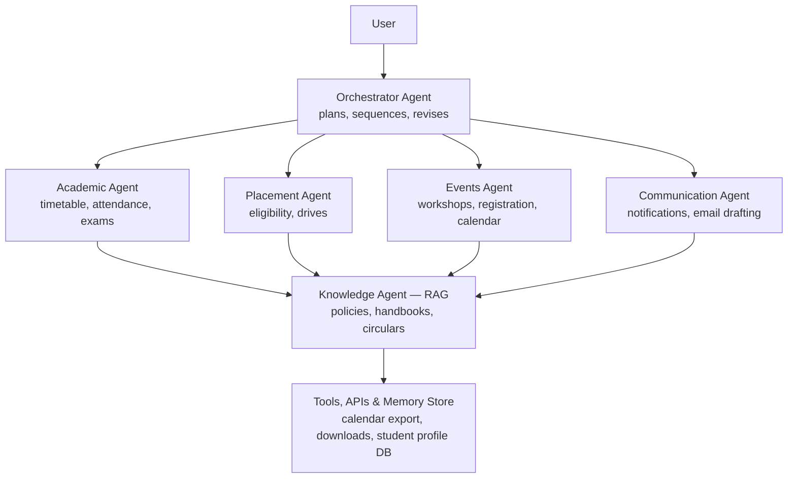

# 🔗 Synapse
### Synapse Multi-Agent AI System — built for AgentX National Level Hackathon 2026

Vasavi College of Engineering (Autonomous) · HackerRank Campus Crew

**🔗 Live demo:** https://campus-multi-agent.onrender.com
**🔗 Source:** https://github.com/bhavyavennapusa1-cell/campus_multi_agent

---

## Overview

Educational institutions run on disconnected platforms — academics, placements, exams, events, hostel, library — and students spend more time switching tabs than getting things done.

Synapse is a proof-of-concept **multi-agent AI system**, not a chatbot with a system prompt. A user sends one natural-language request; an **Orchestrator agent** plans the steps, decides which specialized agents are needed, and dispatches them — pulling from a shared knowledge base, calling tools, and remembering who's asking — to return one coherent answer.

## Why this isn't "just a chatbot"

The problem statement is explicit that the bar is agentic behavior, not Q&A. Here's how this project maps to it:

| Requirement | How it's demonstrated |
|---|---|
| Multi-agent architecture | Orchestrator + Academic / Placement / Events / Communication agents, each with a distinct responsibility |
| Autonomous planning | Orchestrator uses an LLM call to plan and sequence steps — not keyword/if-else routing |
| Multi-agent collaboration | Specialized agents draw on a shared Knowledge agent (e.g. Placement agent consults policy before deciding eligibility) |
| Retrieval-Augmented Generation | Knowledge agent runs real retrieval over sample institutional documents via a vector store |
| Tool / function calling | Agents invoke real tools — calendar export, file downloads, registration, mock data lookups |
| Memory | Student profile (name, branch/year, attendance, hostel) is injected into orchestrator context and persists per logged-in user |
| Context-aware conversations | Follow-up queries reuse the same session state rather than starting cold |
| End-to-end workflow execution | Multi-step requests resolve fully — no manual hand-off between steps |
| Error handling & fallback | Chat gracefully reports backend/connection failures instead of hanging silently |
| Live plan visibility | A **Live Agent Trace** panel shows each step (agent, action, status) as it executes — the planning and reasoning are visible, not just the final answer |

---

## Architecture



User request → Orchestrator (plans + routes) → specialized agents → shared Knowledge agent (RAG) + memory store → mock APIs / SQLite / JSON data layer → synthesized natural-language reply.

---

## Features

- **Home** — landing page introducing the four service domains (Academics, Placements, Events, Services)
- **Assistant workspace** (`chat.html`) — three-panel layout:
  - *Student Memory State* — the profile injected into orchestrator context, personalized to the logged-in user
  - *Chat* — free-text queries (LLM-routed) plus quick-prompt chips for guaranteed demo scenarios
  - *Live Agent Trace* — real-time view of which agent is running, what it's doing, and the result

- **Sign up / Log in / Log out** — accounts are stored persistently; profile data is per-user, not a shared placeholder
- **Real tool actions** — "Add to calendar" generates a real `.ics` file; downloads (e.g. syllabus) deliver real files, not simulated success messages

## Demo queries

These are guaranteed to route correctly and are also available as one-click chips in the Assistant:

**Single-agent**
- "What's my attendance in each subject this semester?"
- "Show me today's timetable"
- "Summarize the examination regulations for CSE 2nd year"
- "Am I eligible for the Google internship drive?"
- "What upcoming placement drives is CSE eligible for?"
- "What workshops are happening this month?"
- "What are the library timings?"
- "How do I file a hostel maintenance complaint?"

**Multi-agent**
- "I'm a 2nd-year CSE student. Am I eligible for the Google internship? If yes, register me for tomorrow's placement workshop, add it to my calendar, and remind me an hour before."
- "Summarize the examination regulations, calculate my attendance eligibility, and draft an email requesting permission for a makeup exam."
- "Show today's classes, recommend upcoming AI workshops, and suggest clubs related to Machine Learning."

---

## Tech stack

| Layer | Technology |
|---|---|
| Frontend | HTML / CSS / JavaScript (custom UI) |
| Backend | Python (see `api_server.py` for the full endpoint list) |
| Orchestration & agents | Python, Anthropic Claude API |
| Knowledge / RAG | ChromaDB vector store over sample institutional documents |
| Data | Mock JSON / SQLite (student records, internships, events, user accounts) |
| Deployment | Render |

## Project structure

```
orchestrator/         Planning + dispatch loop (Uday Veena)
agents/                Academic, placement, campus, communication agents (Sivani Vadrevu)
specialized_agents/    See note below
knowledge/             RAG (rag.py) and memory (memory.py) (Bhavya Vennapusa)
frontend/              Chat UI + live trace panel
data/                  Mock JSON/SQLite data (student records, internships, events)
shared/                Shared schemas/contracts (schemas.py)
api_server.py          Backend API server
requirements.txt       Python dependencies
.env.example           Environment variable template
```

> **Note:** the repo currently has both `agents/` and `specialized_agents/` — confirm which one is live before final submission and remove or document the other to avoid confusing reviewers browsing the code.

## Getting started

```bash
# Clone
git clone https://github.com/bhavyavennapusa1-cell/campus_multi_agent
cd campus_multi_agent

# Set up environment
python -m venv venv
source venv/bin/activate      # Mac/Linux
venv\Scripts\activate         # Windows

pip install -r requirements.txt

# Configure secrets
cp .env.example .env          # fill in your real API key(s) in .env — never commit .env

# Run the backend
python api_server.py

# Serve the frontend (from the frontend/ directory, or open directly if statically hosted)
```

Or just visit the live deployment: **https://campus-multi-agent.onrender.com**

---

## Team

| Role | Owner |
|---|---|
| Orchestrator & planning | Uday Veena |
| Specialized agents | Sivani Vadrevu |
| Knowledge (RAG) & memory | Bhavya Vennapusa |
| Frontend & demo | Suhani Patel |

## Known limitations / roadmap

- Voice interaction, multilingual support, and formal agent-to-agent (A2A) protocol messaging are not yet implemented (stretch goals)
- RAG currently runs over a small sample document set, not full institutional archives
- Explainability is limited to the trace panel's step list rather than per-decision rationale

---

*Built for AgentX — National Level Hackathon 2026, Vasavi College of Engineering (Autonomous), HackerRank Campus Crew.*
